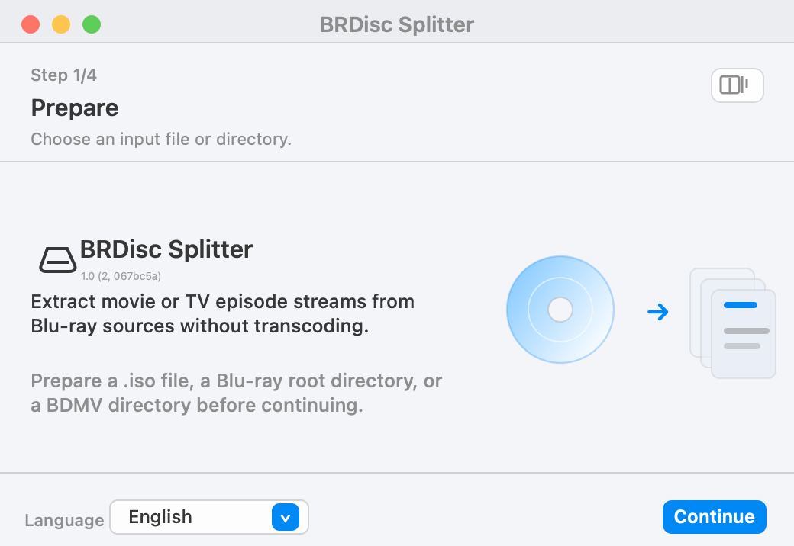
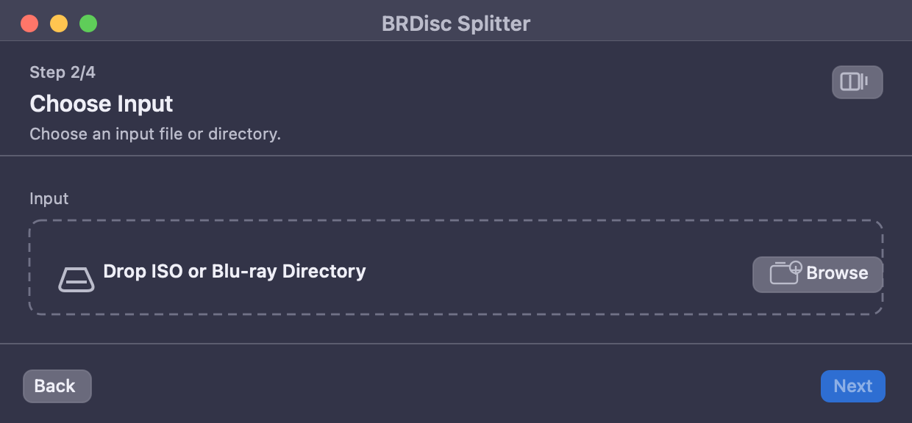

# BRDisc Splitter

中文 | [English](README.md)

BRDisc Splitter 是一个 macOS 图形界面应用，用于从蓝光 ISO 文件或已挂载的蓝光目录中提取电影、剧集媒体流，不转码。普通用户主要使用 Mac App；内置命令行工具保留给高级用户和自动化场景。

## macOS App

<p>
  
  
</p>

从源码构建并启动 App：

```bash
make
```

Makefile 会通过 `BRDiscSplitter.xcodeproj` 构建 `dist/BRDisc Splitter.app` 并启动它，内部可执行文件名为 `BRDiscSplitter`。GUI 默认调用 app 内置资源 `Contents/Resources/brdisc-splitter`；如果需要指定其他脚本位置，可以在高级区域选择。仓库根目录的 `./brdisc-splitter` 会转发到同一份 CLI 脚本，仍可单独调用。

也可以直接用 Xcode 打开 `BRDiscSplitter.xcodeproj`，选择 `BRDiscSplitter` scheme 运行或测试。

基本流程：

- 准备 `.iso` 文件、蓝光根目录或 `BDMV` 目录。
- 拖入 App，或点击 Browse 选择。
- 查看识别出的电影或剧集媒体内容。
- 设置输出目录和提取选项。
- 开始提取；需要排查时再展开日志。

## 运行依赖

BRDisc Splitter 依赖这些外部工具：

- `ffmpeg`
- `ffprobe`
- `jq`

macOS 下处理 ISO 还会使用系统工具 `hdiutil` 和 `plutil`。

## 高级命令行用法

命令行工具面向高级用户、脚本和自动化场景，使用与 App 相同的提取逻辑。

```bash
./brdisc-splitter -i INPUT [options]
```

提取到当前目录：

```bash
./brdisc-splitter -i Movie.iso --name "Movie Name"
```

指定输出目录和并行任务数：

```bash
./brdisc-splitter -i Show.iso -o /path/to/output --name "Show Name" --season 1 --jobs 2
```

只预览提取计划，不写入媒体文件：

```bash
./brdisc-splitter -i Show.iso --dry-run
```

列出可播放文件和关键元数据，不写入媒体文件：

```bash
./brdisc-splitter -i Show.iso --list
```

用系统关联的软件直接打开列表中的第 1 个文件播放，不完整提取：

```bash
./brdisc-splitter -i Show.iso --open 1
```

常用 CLI 选项：

- `-o, --output DIR`：输出目录，默认当前目录。
- `--min-duration SEC`：过滤短流，默认 `1200`。
- `--no-media-dir`：不创建媒体名目录。
- `--no-season-dir`：永不创建 `Season NN` 目录。
- `--episode-start N`：设置起始集号。
- `--use-original-media-container`：保留源媒体容器，例如输出 `.m2ts`。
- `--overwrite`：覆盖已有输出文件。
- `--list`：列出序号、时长、文件大小、视频、音轨、字幕和源文件路径。
- `--open N`：按列表序号用系统关联的软件打开源 `.m2ts` 文件。

Linux 下 CLI 自动挂载 ISO 优先使用 `udisksctl`；否则需要 root 环境支持只读 loop mount。

## 提取行为

BRDisc Splitter 会自动检测来源是电影还是剧集。电影使用最长的候选流；剧集按 `.m2ts` 文件名顺序生成剧集文件。默认输出 mkv 容器，不转码。

列表和打开播放都直接引用蓝光源内的 `.m2ts` 文件。对 ISO 输入，工具会先只读挂载 ISO；如果 ISO 是由工具挂载的，`--open` 会在外部打开命令返回前保持挂载，避免播放器读取期间源文件消失。

剧集输出只有在检测到多季时才创建 `Season NN` 目录。单季输出会直接写入媒体目录，文件名仍包含 `SxxEyy`。

提取过程中，临时文件使用 `final-output-name.partial`。再次运行时，已完成的最终文件会自动跳过，残留的 `.partial` 文件会重新提取。

## 当前限制

- 当前版本直接扫描 `BDMV/STREAM/*.m2ts`，不解析 `.mpls` 播放列表。
- 电影/剧集识别是启发式判断；蓝光结构不提供可靠的媒体类型元数据。
- 多季检测基于输入路径或媒体名中的季范围或多个季标记。
- 工具不会将单个长标题按章节切分为多集。
- ISO 自动挂载仅支持 macOS 和 Linux。其他平台请手动挂载 ISO 后传入挂载目录。

## 许可证

见 [LICENSE](LICENSE)。
